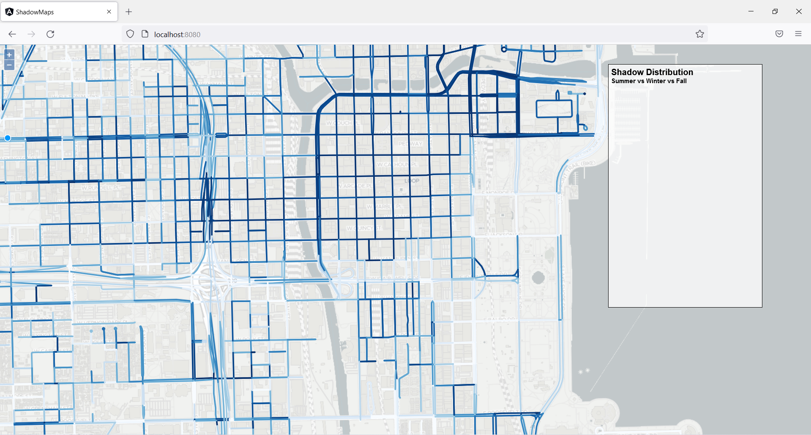
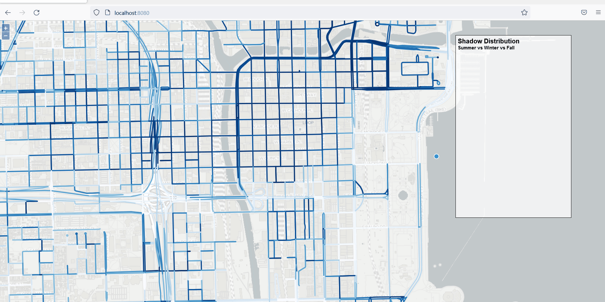

# CS594 - Big Data Visualization & Analytics (Fall 2021)

Instructor: Fabio Miranda

Course webpage: https://fmiranda.me/courses/cs594-fall-2021/

Project Submission by: Lakshmanan Meiyappan
NetID: lmeiya2

## Instructions to Run the project

__Step 1__: Clone the Project
```
git clone https://github.com/uic-big-data/fall-2021-assignment-2-laxmena.git
cd fall-2021-assignment-2-laxmena
```

Note: Step 2 is Optional, as the dist file is already uploaded in the repository

__Step 2__: Build the Angular Project
```
cd vis
npm install
ng build
```
This will generate a dist folder in the `vis\` directory

__Step 3__: Install Python Dependencies using Conda package manager

```
conda install flask
conda install geopandas
```

__Step 4__: Run python server
```
cd ..
python server.py
```

__Step 5__: In localweb browser open the url `http://localhost:8080/` (default port: 8080)

__Step 6__: Once you see the following webpage, use mouse pointer to draw a polygon of your interest.



__Step 7__: To move your selection, **Click your selection once**, you will be able to see the selection color change, now you can move around your selection, and see the statistcal summary of the shadows in the selected region.



